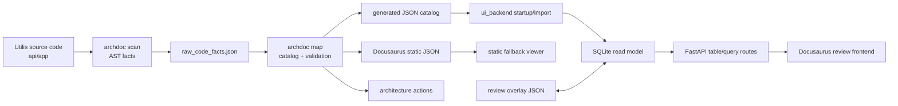

# Archdoc Architecture README

This folder contains the current architecture documentation pipeline for the
Utilis codebase. The system is intentionally split into a deterministic JSON
generator and a separate review UI/backend layer.

For local manual setup and package installation, see:

- [../setup.md](../setup.md)

For a presentation-oriented summary, see:

- `docs/architecture/high-level-overview.md`
- `docs/architecture/high-level-overview.de.md`

## Current Shape



## Ownership Boundaries

### `archdoc`

`archdoc` is the deterministic generator. It should stay a pure JSON-producing
tool.

It owns:

- source scanning
- raw AST fact extraction
- service catalog generation
- endpoint catalog generation
- endpoint-to-service link generation
- architecture action catalog generation
- validation reports
- JSON schema export
- Docusaurus static JSON export

It must not own:

- review workflow state
- frontend editing behavior
- database persistence
- running or mutating the UI backend

Main references:

- `archdoc/README.md`
- `archdoc/src/archdoc/cli.py`
- `archdoc/src/archdoc/scanner/python_scanner.py`
- `archdoc/src/archdoc/mapper/service_mapper.py`
- `archdoc/src/archdoc/mapper/endpoint_mapper.py`
- `archdoc/src/archdoc/linker/endpoint_service_linker.py`
- `archdoc/src/archdoc/validator/catalog_validator.py`
- `archdoc/src/archdoc/overlay/models.py`

Recent mapper/validator changes are recorded in `docs/architecture/changes`,
including internal service-operation validation for application-service to
domain-service delegation and endpoint alias coverage for prefixed FastAPI
routes.

### Generated Catalog

Generated files are replaceable output. They are the current observed
architecture snapshot, not the editable review state.

Important locations:

- `docs/architecture/generated_raw/raw_code_facts.json`
- `docs/architecture/catalog/generated`
- `site/static/archdoc`
- `docs/architecture/schemas`

The static architecture action export is:

- `site/static/archdoc/architecture_actions.json`

Database actions can include structured query details through the optional
`query` field, including assigned query variable, expression, operation,
entities, filters, joins, ordering, limit, and optional `entity_details`.
Entity details are derived from configurable model mappings and can include
model kind, table name, source location, and mapped fields.

The generated docs frontend now includes a service-centered action graph at:

- `site/docs/architecture/generated/service-actions.mdx`

Database action nodes in this graph can open a detail panel. The node label
stays compact, while the panel exposes the full query expression, parsed query
parts, and referenced model/type definitions when the generator could resolve
them.

Service operation nodes also expose generated method details in the graph
inspector: parameters, return annotations, docstring summary, type references,
and a line-ordered action flow. Transaction-like session calls are normalized
to reviewable labels such as `session commit` or `refresh new_user`.

The generator also emits operation dependency links for high-confidence
service-to-service calls and inherited facade operations. These links are imported
into SQLite and shown in the service graph inspector as operation-level outgoing
and incoming links.

Service and operation docstrings are captured as generated source facts. The
graph inspector shows short descriptions and full docstrings for service classes
and service operation methods when the code provides them.

The validation dashboard summarizes endpoint-operation coverage and
operation-to-operation dependency coverage from the SQLite read model. It also
provides grouped filters for open service linkage issues.

When multiple catalog operations point to the same source method, architecture
actions are assigned to every matching operation owner. The validator also flags
service methods that call `self.db.*` when Archdoc cannot resolve a class
resource origin for `self.db`, including direct assignments, inherited origins,
properties, and `super().__init__(db)` forwarding.

The generated data can be deleted and rebuilt from source code. Manual review
decisions should not be written into generated catalog files.

### Overlay Layer

The overlay layer stores human review state separately from generated data.

It owns:

- review status
- labels
- status markers
- owners
- notes
- manual links
- future BPMN and user-story references
- explicit overrides

Important locations:

- `docs/architecture/overlays/review-overlay.json`
- `docs/architecture/overlays/review-overlay.example.json`
- `archdoc/src/archdoc/overlay/models.py`

Overlay entries target generated items by stable target type and ID. This keeps
the generated pipeline deterministic while allowing humans to review, correct,
and classify architecture facts.

### User Stories

Manual user stories are stored separately from generated architecture data:

- `docs/architecture/user-stories`

The UI backend imports Markdown frontmatter and body content into SQLite. Story
endpoint references are linked to generated endpoints by `method + path`, with
tolerance for `/api` path prefixes. A story detail view can then show the linked
router endpoint, endpoint-service link, service, operation, and operation-owned
architecture actions.

The first demo view is available at:

- `site/docs/architecture/generated/user-stories.mdx`

The current implementation is a read model for demo and review workflows. It
does not edit generated JSON and does not yet parse frontend click traces or
BPMN models.

### Identity and Provenance

Catalog items carry an explicit `identity` object in addition to the legacy
`id` field. This is the first step toward stable review targets that can
survive larger generator improvements.

Identity fields:

- `catalog_id`: generated catalog target ID
- `logical_id`: human-readable architecture ID
- `source_id`: deterministic source fingerprint
- `display_name`: UI-friendly label
- `aliases`: compatibility/search aliases

Detection metadata also supports `evidence`, so generated facts can explain the
rule inputs that produced them. The current A1 implementation is documented in:

- `docs/architecture/changes/2026-06-13-a1-identity-provenance-foundation.md`
- `docs/architecture/changes/2026-06-13-a1-deterministic-id-collision-resolution.md`
- `docs/architecture/changes/2026-06-13-a1-validator-resolved-collision-signals.md`
- `docs/architecture/changes/2026-06-13-a2-sqlite-identity-ingestion.md`
- `docs/architecture/changes/2026-06-13-a2-validation-review-workflow.md`
- `docs/architecture/changes/2026-06-13-a2-service-linker-assignment-resolution.md`
- `docs/architecture/changes/2026-06-13-a2-indirect-helper-service-linker.md`
- `docs/architecture/changes/2026-06-14-a3-architecture-action-catalog-foundation.md`
- `docs/architecture/changes/2026-06-14-a3-service-action-graph-ui.md`
- `docs/architecture/changes/2026-06-14-a3-query-info-for-database-actions.md`
- `docs/architecture/changes/2026-06-14-a3-query-entity-details-and-db-action-panel.md`
- `docs/architecture/changes/2026-06-15-user-story-demo-layer.md`
- `docs/architecture/changes/2026-06-16-permission-gate-graph-cleanup.md`
- `docs/architecture/changes/2026-06-16-service-graph-selected-node-inspector.md`
- `docs/architecture/changes/2026-06-16-operation-detail-mapping.md`
- `docs/architecture/changes/2026-06-16-a4-operation-dependency-mapping.md`
- `docs/architecture/changes/2026-06-16-docstring-inspector-mapping.md`
- `docs/architecture/changes/2026-06-16-validation-operation-link-stats.md`
- `docs/architecture/changes/2026-06-16-duplicate-operation-action-ownership.md`
- `docs/architecture/changes/2026-06-16-include-router-prefix-full-path.md`
- `docs/architecture/changes/2026-06-16-user-story-full-width-layout.md`
- `docs/architecture/changes/2026-06-16-user-story-trace-view.md`
- `docs/architecture/changes/2026-06-16-configurable-service-exclusions.md`
- `docs/architecture/changes/2026-06-16-user-story-workspace-layout.md`
- `docs/architecture/changes/2026-06-16-dockerized-docs-site.md`

ID collisions are resolved deterministically before linking. Colliding generated
items receive source-based suffixes, while their previous logical IDs remain in
`identity.logical_id` and `identity.aliases`.
The validator reports resolved collisions as review signals instead of hard
technical errors.

### `ui_backend`

`ui_backend` is the editable review backend. It imports generated JSON into a
local SQLite read model and keeps review data persistent.

It owns:

- SQLite schema creation
- generated JSON import on startup
- replaceable generated tables
- persistent review tables
- overlay JSON import/export
- FastAPI routes for catalog and table access
- server-side search, filtering, sorting, and pagination

It does not own:

- running `archdoc scan`
- running `archdoc map`
- modifying generated JSON files

Main references:

- `ui_backend/README.md`
- `ui_backend/app/main.py`
- `ui_backend/app/storage.py`
- `ui_backend/app/models.py`
- `ui_backend/app/settings.py`

The current default database path is:

- `docs/architecture/archdoc-review.sqlite3`

Generated tables are safe to replace during import. Review tables are not
overwritten by generated imports.

### Docusaurus Frontend

The frontend is still hosted inside Docusaurus, but the architecture catalog
views now behave more like a review application.

It owns:

- table presentation
- review editor controls
- frontend feature structure
- API client calls
- static fallback behavior

Current feature layout:

- `site/src/features/archdoc/api`
- `site/src/features/archdoc/catalog`
- `site/src/features/archdoc/components`
- `site/src/features/archdoc/constants`

The old component entrypoints under `site/src/components/archdoc` remain as
thin compatibility wrappers for MDX/Docusaurus imports.

## Data Flow

### 1. Generate Architecture Data

Run from `docs-site-docasaurus`:

```bash
archdoc scan -c archdoc.yml
archdoc map -c archdoc.yml
```

This updates raw facts, generated catalog JSON, validation output, and static
Docusaurus JSON.

### 2. Export Schemas

```bash
archdoc export-schemas -c archdoc.yml
```

Schemas describe the generated artifacts and overlay contract. They are useful
as a boundary between the generator and future UI/backend tooling.

### 3. Import Generated JSON Into SQLite

The backend imports generated JSON on startup when the source hash changed.
Generated tables are cache/read-model tables.

Manual reimport:

```bash
curl -X POST "http://localhost:8010/api/import/generated?force=true"
```

This replaces generated table contents but preserves review tables.

### 4. Query From Frontend

The large catalog tables should use backend table routes:

- `GET /api/table/endpoints`
- `GET /api/table/operations`
- `GET /api/table/interfaces`

Search, filter, sort, and pagination are performed against SQLite. The browser
should not load the full effective catalog for large table workflows.

The effective catalog endpoint still exists for compatibility and smaller
overview use cases:

- `GET /api/catalog/effective`

## SQLite Model

The database is a middle layer between generated JSON and editable UI state.
Generated identity fields are stored as first-class query columns, not only in
`payload_json`.

Generated/imported tables:

- `import_runs`
- `generated_services`
- `generated_operations`
- `generated_endpoints`
- `generated_links`
- `generated_validation_issues`
- `generated_validation_reports`

Persistent review tables:

- `review_items`
- `review_labels`
- `review_status_markers`

Rule of thumb:

- generated tables can be rebuilt from JSON
- review tables are user-authored state
- overlay JSON mirrors review state for portability and versioning
- identity columns are the bridge between generated IDs, old overlay targets,
  and review UI queries

## Current Table Behavior

The shared React `DataTable` supports two modes:

- local mode for small static datasets
- server mode through `fetchData`

The architecture catalog views now use server mode. They send:

- `search`
- `limit`
- `offset`
- `sort`
- `direction`
- filter values

The backend returns:

- `rows`
- `total`
- `limit`
- `offset`

Endpoint table filters:

- method
- contract
- linkage
- review status

Operation table filters:

- coverage
- review status

Interface table filters:

- confidence
- review status

Validation issue table filters:

- severity
- issue code presets
- review status

## Design Decision: Why SQLite

The generated JSON is already large enough that browser-side querying becomes
awkward. SQLite gives the review UI a queryable middle layer without making
`archdoc` itself stateful.

This keeps the separation clear:

- `archdoc` remains reproducible and deterministic
- `ui_backend` handles interactive review workflows
- generated data can be refreshed without destroying human review state
- future relational features can be added without changing the generator into a
  database application

## Next Architecture Steps

Useful next improvements:

- normalize high-use query fields into SQLite columns instead of reading them
  from `payload_json`
- add dedicated backend services below FastAPI routes once route logic grows
- add migration/version handling for the SQLite schema
- add table routes for validation issues and service catalog review
- add BPMN/user-story tables as overlay-owned concepts linked to generated IDs
- generate a typed frontend API client once the backend API stabilizes

## Current Non-Goals

These are intentionally out of scope for the current layer:

- semantic proof of business architecture correctness
- runtime tracing
- automatic code modification
- editing generated JSON directly
- storing production Utilis tenant data
- replacing the main Utilis backend

This project is currently best understood as a deterministic architecture
documentation pipeline plus a lightweight review application layered on top.
