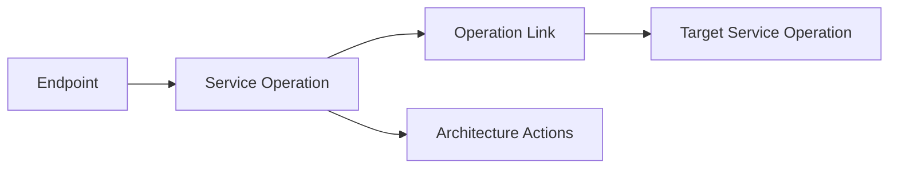

# A4 Operation Dependency Mapping

## Context

The generated architecture graph could show router-to-operation links and
operation-owned actions such as database, audit, permission, worker, and
external calls. It could not yet show when one service operation delegates work
to another service operation.

## Change

Added a generated operation dependency catalog:

- `docs/architecture/catalog/generated/links/operation_links.json`
- `site/static/archdoc/operation_links.json`
- `docs/architecture/schemas/operation-link-item.schema.json`
- `docs/architecture/schemas/static-operation-links-payload.schema.json`

The first mapper detects service calls from operation methods by resolving:

- local service variables, for example `audit_service = AuditService(db)`
- constructor assignments on `self`, for example `self.audit_service = AuditService(db)`
- calls through those variables or attributes, for example
  `await self.audit_service.log_event(...)`
- direct service-constructor call forms where the scanner exposes them as a
  callable service target

Each detected link records:

- source service operation
- target service
- target operation when resolvable
- call name
- source location
- confidence and evidence

## Runtime Read Model

The UI backend imports the generated `operation_links.json` file into SQLite in
`generated_operation_links`. The service action graph API now returns matching
operation links for the selected service.

The graph inspector uses these links in operation details:

- `Calls Services`
- `Called By`

## Design Rationale

Operation dependency mapping is kept separate from `architecture_actions`.
Actions describe what a method does against infrastructure or domain entities.
Operation links describe orchestration between service methods.

This keeps the generated model easier to query:

## Current Limits

The first A4 pass intentionally focuses on high-confidence service-instance
calls. It does not yet infer every helper-to-operation path, repository pattern,
factory-created service, dependency-injected provider, or inherited orchestration
path.

Unresolved but likely next improvements:

- helper function chains that pass services as parameters
- constructor dependency fields with annotation-only declarations
- service factories and provider containers
- service-to-service graph edges as optional topology nodes
- user-story trace view using operation links

## Verification

- Python compile for edited archdoc modules
- `archdoc map -c archdoc.yml`
- `archdoc export-schemas -c archdoc.yml`
- forced SQLite generated import
- direct service graph payload checks
- `npm run typecheck`
