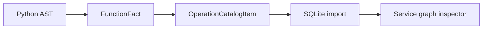

# Operation Detail Mapping

## Context

Service operation nodes were useful as topology anchors, but not detailed enough
for review. For example, `AdminUserService.create_user` showed no parameters,
mixed type references into the method flow, and represented session calls as
generic database transaction nodes.

## Change

The generator now carries method-level information from scan facts into the
service operation catalog:

- function and method docstrings
- operation description from the first docstring line
- parameter names, annotations, defaults, and parameter kind
- return annotation

Database transaction resources were normalized for common session calls:

- `self.db.flush()` -> `session flush`
- `self.db.commit()` -> `session commit`
- `self.db.refresh(new_user)` -> `refresh new_user`
- `self.db.rollback()` -> `session rollback`

Database action labels in the graph include the concrete session/query verb
where possible, for example `get Experiment` instead of only `Experiment`.

Query entity detection now resolves model references inside SQLAlchemy aggregate
expressions. For example, `select(func.sum(Payout.amount))` is mapped to
`select Payout` instead of `select func`, and helper expressions such as
`func`, `case`, `cast`, or local label variables are not treated as database
entities.

The service action graph inspector now separates pure type usages from the
chronological method flow. Types stay visible as operation context, but they no
longer render as graph nodes because they are not architectural topology. The
flow focuses on executable actions such as queries, transactions, audit calls,
permission checks, workers, and external calls.

## Design Rationale

The method-level catalog is intentionally still generated and deterministic.
It does not infer business intent beyond information that is already present in
the source code. The UI can then provide a review-friendly view without changing
the generated source of truth.

This keeps the layering clear:

## Verification

- `python -m compileall` equivalent for edited mapper/scanner modules
- `archdoc scan -c archdoc.yml`
- regenerated mapped catalogs and static Docusaurus data
- forced `ui_backend` generated import
- verified `admin.admin-user.operation.create_user` now exposes parameters,
  return annotation, and description
