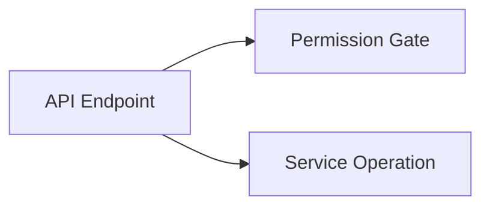
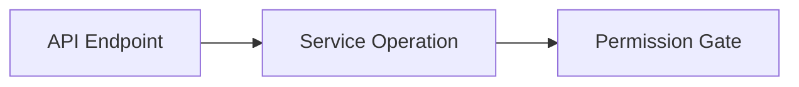

# Permission Gate Graph Cleanup

## Context

The service action graph showed some permission nodes with the label
`Depends`. These were not meaningful architecture actions. They came from
FastAPI dependency wrapper calls such as:

```python
Depends(require_permission(...))
Depends(require_org_context)
```

The actual architecture signal is the inner permission or context dependency,
not the `Depends(...)` wrapper itself.

## Change

The action mapper now skips `Depends(...)` wrappers when they wrap known
permission or tenant-context gate calls:

- `require_permission`
- `require_any_permission`
- `has_permission`
- `require_org_context`

The permission pattern matching was also narrowed so unrelated string/regex
calls containing permission-like text, such as `re.compile(...)`, are no longer
classified as permission actions.

Router decorator dependencies are still allowed when they define permissions via
`dependencies=[Depends(require_permission(...))]`, because those are real
endpoint-level permission gates.

## Graph Semantics

Router-level permissions are displayed as endpoint gates. They should not look
like service-internal behavior because FastAPI resolves them before the route
body calls the service.

Conceptually:



not:



## Verification

After regeneration:

- `permission_actions`: 402
- `depends_permission_actions`: 0

Validation performed:

- Python compile for the mapper
- static Archdoc JSON export
- SQLite generated import
- `npm run typecheck`
- `npm run build`
