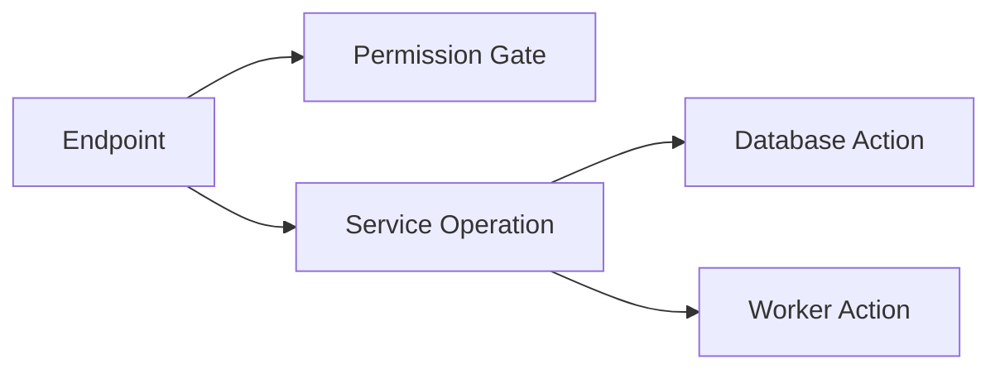

# Service Graph Selected Node Inspector

## Context

The service action graph was becoming too dense because detailed information was
encoded directly as graph nodes. Database action details were displayed in a
separate section below the graph, which made the interaction feel disconnected
from the selected node.

## Change

Added a generalized selected-node inspector inside the graph shell. Clicking a
graph node now opens a right-side detail panel.

The inspector supports:

- service nodes
- endpoint nodes
- operation nodes
- action nodes
- external/worker target nodes

Database action query information moved into the inspector. Worker actions,
permission gates, endpoint metadata, service metadata, operation parameters, and
a line-ordered action sequence are also shown where data is available.

## Design Direction

The graph should primarily show topology:

Detailed data belongs in the inspector:

- parameters
- query details
- model/entity fields
- worker job payload
- permission requirement
- source locations
- chronological detected actions

This keeps the graph readable while preserving inspectability.

## Verification

- `npm run typecheck`
- `npm run build`
