# Archdoc High-Level Overview

Dieses Dokument erklaert die implementierte Architektur von Archdoc vom
Source-Code-Scan bis zur SQLite-basierten Review-Oberflaeche.

## Zielbild

Archdoc ist eine deterministische Pipeline fuer Architektur-Dokumentation,
Analyse und Review.

Aktuell besteht das System aus drei groben Teilen:

- **Archdoc Generator** analysiert Source Code und erzeugt JSON.
- **UI Backend** importiert JSON und manuelle Dokumentation in SQLite.
- **Docusaurus Frontend** visualisiert Tabellen, Graphen und User Stories.

Die wichtigste Grenze ist:

> `archdoc` erzeugt Daten. `ui_backend` importiert und fragt Daten ab. Das
> Frontend visualisiert und reviewed. Menschliche Review-Daten werden nicht in
> generated JSON geschrieben.

## Gesamtueberblick

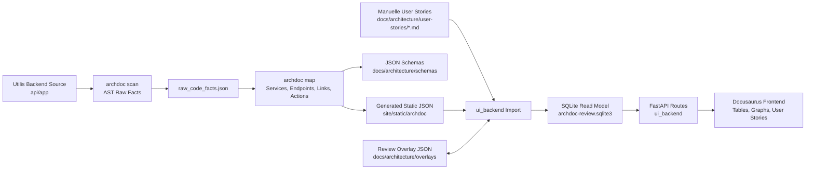

## Rollen der Komponenten

### `archdoc`

`archdoc` ist der deterministische Generator. Er liest Source Code und erzeugt
ersetzbare Architektur-Daten.

`archdoc` macht aktuell:

- Python AST Scan
- Raw Code Facts
- Service-Erkennung
- FastAPI Endpoint-Erkennung
- Endpoint-zu-Service Linking
- Architecture Action Detection
- Validator Reports
- JSON Schema Export
- Static JSON Export fuer Docusaurus

`archdoc` sollte nicht machen:

- menschliche Review-Staende speichern
- UI-Editing besitzen
- SQLite als primaere Runtime-Datenbank verwalten
- Frontend- oder Backend-Interaktion steuern

### `ui_backend`

`ui_backend` ist die interaktive Review-Schicht. Es importiert generierte JSONs
und manuelle User-Story-Dateien in SQLite.

`ui_backend` macht aktuell:

- SQLite Schema
- Import der generated JSON Dateien
- Import der Markdown User Stories
- Import/Export des Review Overlays
- serverseitige Suche, Sortierung, Filterung und Pagination
- API fuer Service Action Graph
- API fuer User Story Linking

`ui_backend` macht bewusst nicht:

- Source Code scannen
- generated JSON erzeugen
- produktive Utilis Tenant-Daten speichern

### Docusaurus Frontend

Docusaurus ist aktuell die Shell fuer Dokumentation und interaktive Views.

Das Frontend macht aktuell:

- API Endpoint Catalog
- Endpoint-Service Interface Tabelle
- Service Operation Tabelle
- Service Action Graph
- Validation Issues
- User Story Review und Trace View
- Review Controls
- Static Fallback, falls Backend nicht laeuft

## Daten-Layer

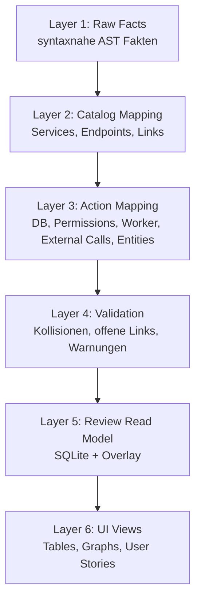

### Layer 1: Raw Facts

Output:

- `docs/architecture/generated_raw/raw_code_facts.json`

Ziel:

- Code syntaktisch und deterministisch erfassen
- noch keine zu starke Architektur-Interpretation
- Source Locations fuer Erklaerbarkeit behalten

Beispiele:

- Klassen
- Methoden/Funktionen
- Decorators
- Calls
- Assignments
- Klassenfelder
- FastAPI Route Signale

### Layer 2: Catalog Mapping

Hier entstehen:

- Services
- Service Operations
- API Endpoints
- Endpoint-Service Links

Beispiel:

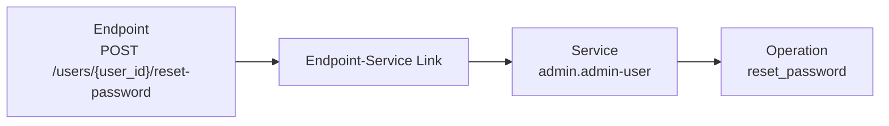

### Layer 3: Architecture Actions

Output:

- `site/static/archdoc/architecture_actions.json`

Ziel:

- sichtbar machen, was eine Operation intern tut
- nicht nur zeigen: Endpoint ruft Service auf
- sondern auch: Service liest/schreibt DB, prueft Permissions, queued Worker usw.

Aktuelle Action-Arten:

- `database_action`
- `database_transaction`
- `permission_action`
- `worker_action`
- `external_action`
- `audit_action`
- `entity_declaration`
- `type_usage`

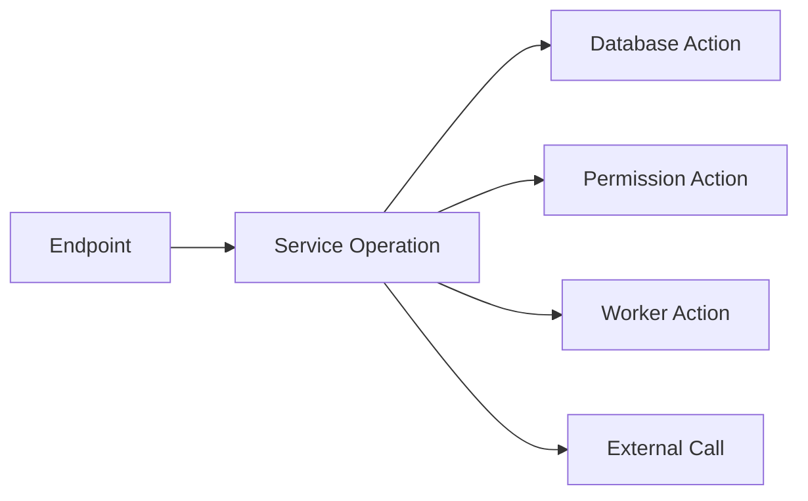

## Query- und Model-Details

Database Actions enthalten inzwischen strukturierte Query-Informationen.

Nicht nur:

```text
execute: select IAMUser where IAMUser.id == user_id
```

Sondern auch:

- Query Variable
- voller Query-Ausdruck
- Operation, z.B. `select`
- Entities, z.B. `IAMUser`
- Filter
- Joins
- Ordering
- Limit
- Entity Details

Entity Details werden ueber konfigurierbare Model-Mappings erkannt:

```yaml
mapping:
  entities:
    paths:
      - models
      - app/models
    field_value_calls:
      - Column
      - mapped_column
      - relationship
```

Dadurch kann die UI bei Database Action Nodes ein Detail-Panel anzeigen:

- Query
- Filter
- Tabelle
- Model-Felder
- Source Location

## Worker Detection

Worker-Erkennung ist konfigurierbar, weil jedes Projekt Worker anders baut.

Utilis nutzt nicht nur klassische Queue-Calls wie `.delay()`, sondern auch:

- `enqueue_job(job_type=...)`
- `Job(job_type=...)`

Die aktuelle Config erkennt:

- direkte Worker Dispatch Calls
- Job Model Constructor Calls
- klassische Queue Method Suffixes

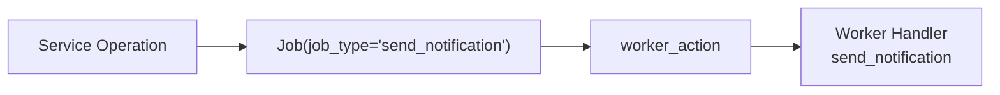

Damit werden z.B. Worker-Actions sichtbar in:

- `NotificationService`
- `UnifiedCampaignService`
- `SessionManagementService`
- Privacy Request Fulfillment

## SQLite Read Model

SQLite ist die mittlere Schicht zwischen generated JSON und interaktiver UI.

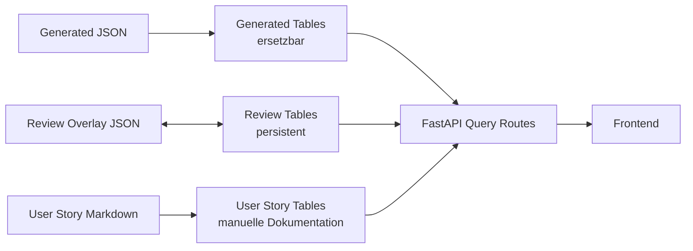

Generated Tabellen koennen ersetzt werden:

- `generated_services`
- `generated_operations`
- `generated_endpoints`
- `generated_links`
- `generated_actions`
- `generated_validation_issues`

Review Tabellen bleiben erhalten:

- `review_items`
- `review_labels`
- `review_status_markers`

Manuelle User Story Daten:

- `user_stories`

Der Vorteil:

> Ein neuer Archdoc-Lauf kann generated Daten ersetzen, ohne menschliche Reviews
> zu zerstoeren.

## Overlay Layer

Das Overlay speichert menschliche Review-Daten getrennt von generated Daten.

Overlay kann enthalten:

- Review Status
- Labels
- Status Marker
- Owner
- Notes
- manuelle Links
- Overrides

Moegliche Target Types:

- `service`
- `operation`
- `endpoint`
- `endpoint_service_link`
- `architecture_action`
- `validation_issue`
- `user_story`
- spaeter `bpmn_process`, `bpmn_task`

## Frontend Views

Aktuelle Views:

- API Endpoint Catalog
- Endpoint-Service Interfaces
- Service Operations
- Service Action Graph
- Validation Issues
- User Stories

### Service Action Graph

Der Service Graph ist eine service-zentrierte Architekturansicht.

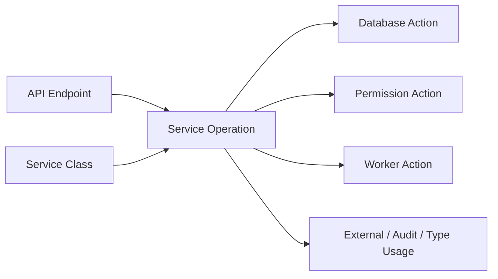

Database Action Nodes sind klickbar und zeigen:

- Source
- Query Expression
- Filter
- Model/Entity Details
- Felder und Tabellenname

### User Stories

Manuelle User Stories liegen in:

- `docs/architecture/user-stories/*.md`

Die Review-Ansicht verlinkt User Stories ueber Endpoint-Referenzen auf echte Backend-
Architektur.

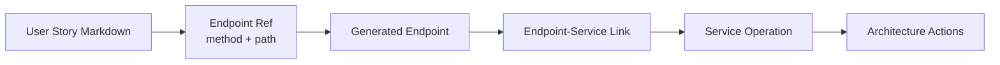

Beispiel:

- `US-ADMIN-001`
- Endpoint: `POST /users/{user_id}/reset-password`
- Service: `admin.admin-user`
- Operation: `reset_password`

## Was bereits funktioniert

Aktuell vorhanden:

- Source Code Scan
- Service Detection
- Endpoint Detection
- Endpoint-Service Linking
- Validation Issues
- SQLite Import
- Review Overlay
- serverseitige Tabellen
- Service Action Graph
- DB Query Details
- Model/Entity Details
- Worker Action Detection
- User Story Review und Trace View

## Moegliche Erweiterungen

### 1. Service-to-Service Verbindungen

High-confidence Service-zu-Service-Aufrufe und geerbte Facade-Operationen
werden bereits als Operation-Dependency-Links erzeugt, in SQLite importiert und
im Service-Graph-Inspector dargestellt. Dynamische oder indirekte Aufrufmuster
bleiben eine heuristische Grenze und sollten ueber Validation und Review
kontrolliert werden. Ein solcher erkannter Ablauf kann beispielsweise so
dargestellt werden:

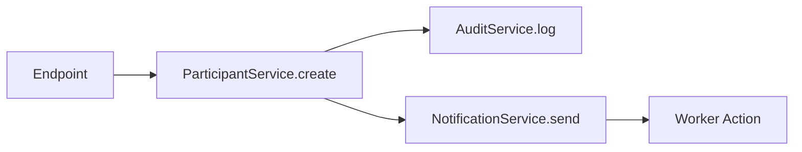

### 2. Full BPMN

BPMN ist noch nicht als vollwertige Architektur-Schicht integriert.

Noch fehlt:

- BPMN Prozessschema
- BPMN Task Schema
- Links von BPMN Tasks zu User Stories
- Links von BPMN Tasks zu Endpoints/Services
- BPMN Editor oder Viewer
- Validierung: Task ohne technische Umsetzung, Endpoint ohne Prozessbezug usw.

Zielbild:

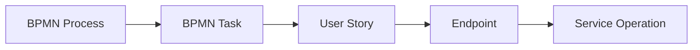

### 3. Full User Stories

Die User-Story-Ansicht ist aktuell ein Read-Model-Ansatz.

Noch fehlt:

- formales User Story JSON Schema
- Validator fuer Story-Qualitaet
- Parsing von Ablauf, Akzeptanzkriterien, Fehlerfaellen
- Status-/Review-Workflow fuer Stories
- Links zu Frontend Actions
- Links zu BPMN
- Coverage: welche Endpoints haben keine Story?
- Coverage: welche Stories haben keinen Endpoint?

Zielbild:

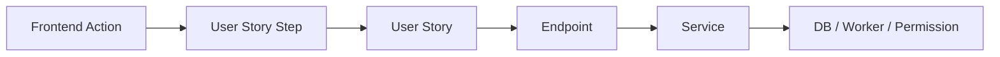

### 4. Frontend Action Capture

Aktuell werden Frontend Button Actions noch manuell dokumentiert.

Noch fehlt:

- Schema fuer Frontend Actions
- Import aus Markdown oder JSON
- spaeter eventuell automatisierte Extraktion aus Frontend-Code
- Verbindung Button/Route/Page zu User Story Step
- Verbindung User Story Step zu API Call

### 5. Staerkere Validator-Regeln

Sinnvolle weitere Regeln:

- User Story Endpoint existiert nicht
- Endpoint hat keine User Story
- BPMN Task hat keine technische Umsetzung
- Service-to-Service Call nicht modelliert
- Worker Job Type hat keinen Handler
- Permission Action fehlt fuer kritischen Endpoint
- doppelte Service-/Model-Namen als Review-Signal
