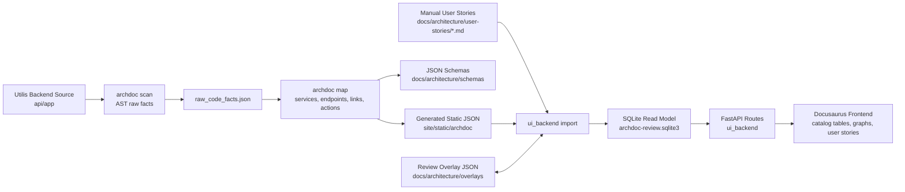
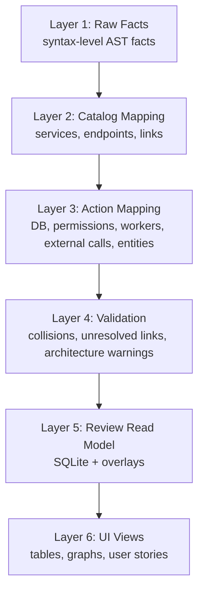
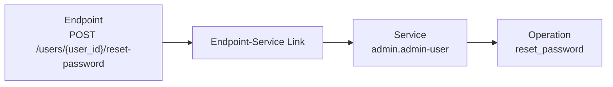
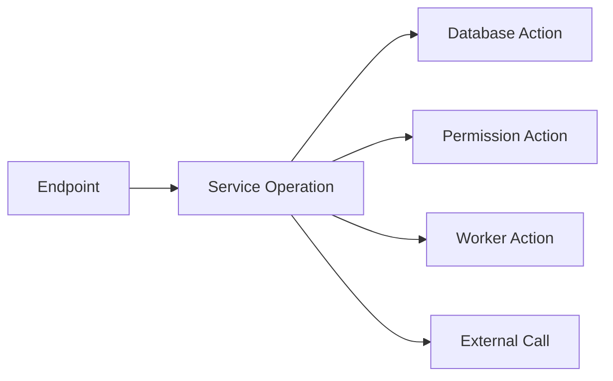
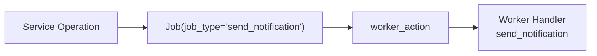
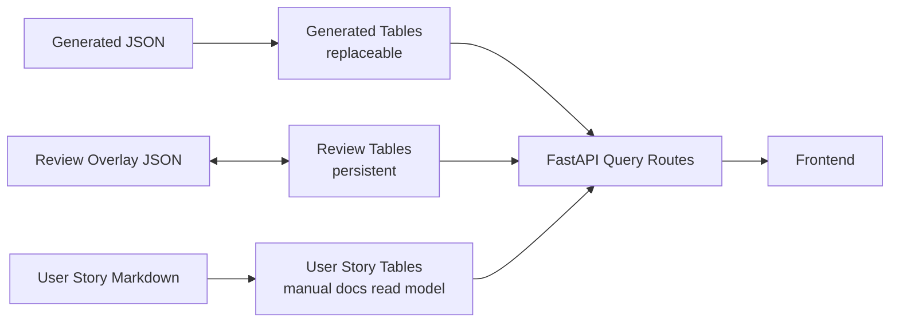
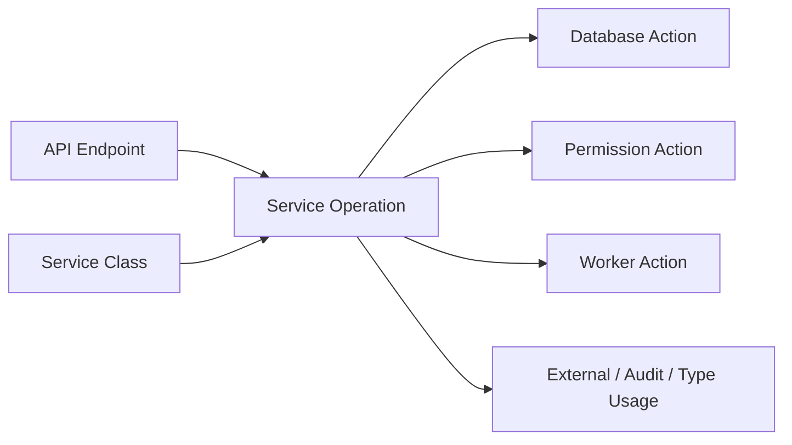
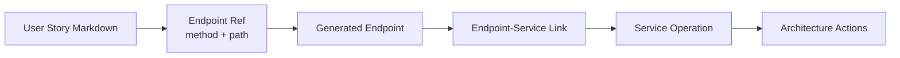

# Archdoc High-Level Overview

This document explains the implemented Archdoc architecture from source-code
analysis to the SQLite-backed review UI.

## Goal

Archdoc is a deterministic architecture documentation and review pipeline.

The current system has three major responsibilities:

- **Generate architecture facts from source code**
- **Import generated facts into a queryable review backend**
- **Visualize and review architecture data in the docs frontend**

The important boundary is:

> `archdoc` generates JSON. `ui_backend` imports and queries it. The frontend
> visualizes and reviews it. Human review state is not written into generated
> JSON.

## Big Picture



## Component Responsibilities

### `archdoc`

`archdoc` is the deterministic generator. It reads source code and produces
replaceable generated architecture data.

It currently owns:

- Python AST scanning
- raw syntax facts
- service detection
- FastAPI endpoint detection
- endpoint-to-service linking
- architecture action detection
- validator reports
- JSON schema export
- static Docusaurus JSON export

It should not own:

- human review state
- UI editing workflows
- SQLite persistence
- frontend/backend runtime behavior

### `ui_backend`

`ui_backend` is the interactive review backend. It imports generated JSON and
manual story files into SQLite.

It currently owns:

- SQLite schema
- generated JSON import
- user-story Markdown import
- overlay import/export
- server-side table search, sort, filter, pagination
- service graph API
- user-story linking API

It should not own:

- source-code scanning
- generated catalog ownership
- production Utilis tenant data

### Docusaurus Frontend

The frontend is still hosted in Docusaurus, but the generated architecture pages
now behave like a small review app.

It currently owns:

- architecture catalog tables
- review/status controls
- service action graph
- database-action detail panel
- user-story review and trace view
- static fallback loading

## Data Layers



### Layer 1: Raw Facts

Output:

- `docs/architecture/generated_raw/raw_code_facts.json`

Purpose:

- capture code facts without interpreting architecture too early
- keep scanning deterministic
- preserve source locations for later explanation

Examples:

- classes
- methods/functions
- decorators
- calls
- assignments
- class fields
- detected route signals

### Layer 2: Catalog Mapping

Outputs:

- services
- operations
- endpoints
- endpoint-service links

Purpose:

- identify architectural building blocks
- connect FastAPI routes to service operations

Important relation:



### Layer 3: Architecture Actions

Output:

- `site/static/archdoc/architecture_actions.json`

Purpose:

- show what a service operation actually does internally
- make services explainable beyond just "endpoint calls method"

Current action kinds:

- `database_action`
- `database_transaction`
- `permission_action`
- `worker_action`
- `external_action`
- `audit_action`
- `entity_declaration`
- `type_usage`

Example:



## Query and Model Detail Detection

Database actions can now carry structured query information.

Instead of only showing a shortened string like:

```text
execute: select IAMUser where IAMUser.id == user_id
```

Archdoc stores:

- query variable
- full expression
- operation, for example `select`
- entities, for example `IAMUser`
- filters
- joins
- ordering
- limit
- entity details

Entity details are derived from configured model mappings:

```yaml
mapping:
  entities:
    paths:
      - models
      - app/models
    field_value_calls:
      - Column
      - mapped_column
      - relationship
```

This allows the graph UI to open a database-action detail panel showing model
fields and table names.

## Worker Detection

Worker actions are configurable because worker systems differ between projects.

Utilis does not mainly use Celery-style `.delay()` calls. It uses custom job
rows and `enqueue_job(...)`.

Current worker config supports:

- `enqueue_job(job_type=...)`
- `Job(job_type=...)`
- classic suffixes like `.delay`, `.apply_async`, `.enqueue`, `.send_task`

Example:



This is why services like `NotificationService`, `UnifiedCampaignService`, and
`SessionManagementService` now show worker-related actions.

## SQLite Read Model

SQLite is the middle layer between generated JSON and interactive UI workflows.



Generated tables are safe to replace:

- `generated_services`
- `generated_operations`
- `generated_endpoints`
- `generated_links`
- `generated_actions`
- `generated_validation_issues`

Review tables are persistent:

- `review_items`
- `review_labels`
- `review_status_markers`

Manual user-story data:

- `user_stories`

This prevents a generated refresh from destroying human review state.

## Overlay Layer

The overlay stores human review metadata separately from generated facts.

Overlay can hold:

- review status
- labels
- markers
- owner
- notes
- manual links
- overrides

Example target types:

- `service`
- `operation`
- `endpoint`
- `endpoint_service_link`
- `architecture_action`
- `validation_issue`
- `user_story`

This is important because generated IDs and facts may change over time, while
human review decisions should remain portable.

## Frontend Views

Current generated docs views:

- API Endpoint Catalog
- Endpoint-Service Interfaces
- Service Operations
- Service Action Graph
- Validation Issues
- User Stories

### Service Action Graph

The service graph shows a service-centered architecture view.



Database-action nodes are clickable and open a detail panel with:

- action source
- query expression
- parsed filters
- entity/model details
- mapped fields

### User Stories

Manual user stories live in:

- `docs/architecture/user-stories/*.md`

The current review view links a user story to generated backend architecture via
declared endpoint references.



Example catalog trace:

- `US-ADMIN-001`
- endpoint: `POST /users/{user_id}/reset-password`
- linked service: `admin.admin-user`
- linked operation: `reset_password`

## End-to-End Workflow

The operational workflow is:

1. Archdoc scans the backend source code deterministically.
2. It maps source facts into architecture catalogs.
3. It detects endpoints, services, links, database actions, workers, permissions,
   and model/entity details.
4. The UI backend imports the generated JSON into SQLite.
5. Human review state is kept separately in overlays.
6. Docusaurus displays the generated catalogs as interactive tables and graphs.
7. Manual user stories can now be linked to real backend architecture through
   endpoint references.

## Why Docusaurus For Now

Docusaurus is still useful because:

- docs, generated pages, and MDX are already integrated
- the architecture viewer can be deployed with the documentation
- static JSON fallback still works
- the team can read narrative docs next to interactive views

A separate React app may make sense later when:

- editing becomes the primary workflow
- BPMN/user-story modeling becomes complex
- authentication and multi-user review workflows matter
- the UI is no longer primarily documentation-adjacent

For the current documentation-centered workflow, Docusaurus remains a useful
shell.

## Known Limits

Current limits:

- frontend click traces are not yet automatically scanned
- user-story Markdown parsing is still frontmatter-first
- BPMN is not yet modeled as a first-class linked artifact
- some dynamic job types remain expressions like `job_type`
- query parsing is expression-based, not a full SQLAlchemy semantic interpreter
- duplicate model/service names should later become stronger validator signals

## Possible Next Steps

Possible extensions are:

1. Add a first-class user-story schema file and validator.
2. Add frontend-action references to user stories.
3. Add a user-story graph view.
4. Link user stories to BPMN tasks.
5. Add validator warnings for missing endpoint refs and unresolved story links.
6. Normalize high-value action fields into SQLite columns for faster querying.
7. Decide later whether to keep Docusaurus or split into a standalone React app.

